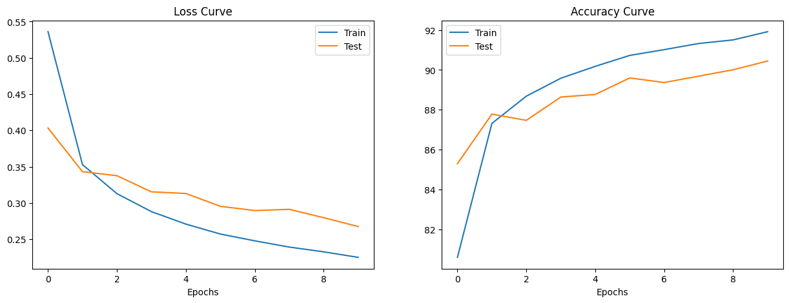
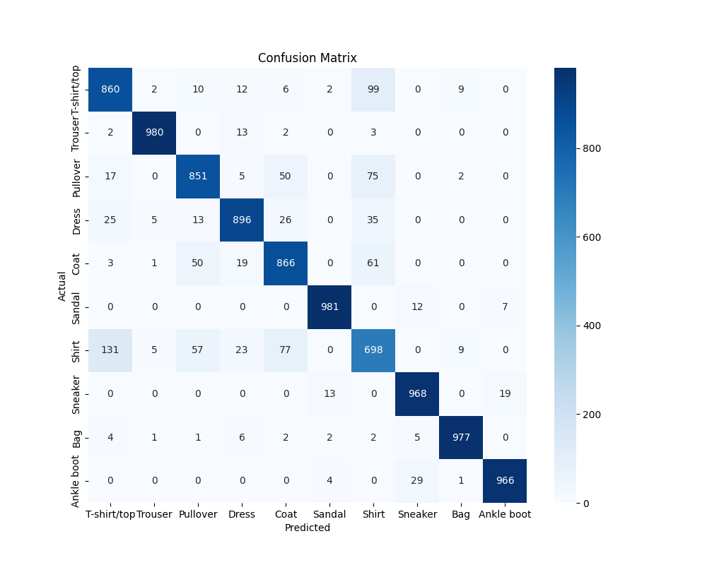

# 👕 FashionMNIST Classification with PyTorch CNN


A modular, production-oriented Convolutional Neural Network (CNN) implementation to classify clothing items from the [FashionMNIST dataset](https://github.com/zalandoresearch/fashion-mnist).

This project demonstrates a professional Deep Learning workflow, moving from a monolithic notebook to a structured, maintainable codebase with separate modules for training, evaluation, and utilities.

## 📊 Results

The **TinyVGG** architecture achieved **>90% accuracy** on the test set after 10 epochs, significantly outperforming baseline linear models.

| Metric | Value |
| :--- | :--- |
| **Test Accuracy** | **90.45%**|
| **Test Loss** | 0.267 |
| **Training Time** | ~2 mins (on CUDA) |

### Training Performance

*Figure 1: Loss and Accuracy curves showing steady convergence without significant overfitting.*

### Model Evaluation

*Figure 2: Confusion Matrix highlighting class-specific performance. The model distinguishes distinct items (Trousers, Bags) well but occasionally confuses similar geometric shapes (Coat vs. Pullover).*

## 🏗️ Project Structure

The project is organized to separate concerns, mimicking a production ML repository:

```text
├── notebooks/             # Jupyter Notebooks for experimentation
│   └── cnn_fashionmnist.ipynb
│   └── data/              # Dataset storage (auto-downloaded)
├── src/                   # Source code modules
│   ├── __init__.py
│   ├── model.py           # TinyVGG CNN Architecture class
│   ├── training.py        # Training loop logic
│   ├── evaluate.py        # Evaluation & Confusion Matrix logic
│   └── utils.py           # Helper functions (plotting, seeding)
├── images/                # Saved plots for README
├── requirements.txt       # Python dependencies
└── README.md              # Project documentation
```
## 🧠 Model Architecture (TinyVGG)
The model replicates the TinyVGG architecture, consisting of two convolutional blocks followed by a classifier head:

1. Conv Block 1: Conv2d -> ReLU -> Conv2d -> ReLU -> MaxPool2d
2. Conv Block 2: Conv2d -> ReLU -> Conv2d -> ReLU -> MaxPool2d
3. Classifier: Flatten -> Linear Output Layer

## 🚀 Getting Started
### Prerequisites

* Python 3.8+
* pip

### Installation
1. Clone the repository
```bash
git clone [https://github.com/yourusername/pytorch-fashionmnist.git](https://github.com/yourusername/pytorch-fashionmnist.git)
```
2. Install dependencies
```bash
pip install -r requirements.txt
```
3. Run the Notebook Launch Jupyter and open notebooks/cnn_fashionmnist.ipynb to step through the training process.

## 🛠️ Future Improvements
* Implement Data Augmentation (RandomHorizontalFlip, Rotation) to improve generalization on "hard" classes like Shirt/Pullover.
* Experiment with Batch Normalization layers to speed up convergence.
* Deploy the model using FastAPI or Streamlit for a web-based demo.

## 🤝 Contributing
Feel free to fork this project and submit a Pull Request if you have suggestions for optimizing the architecture!
